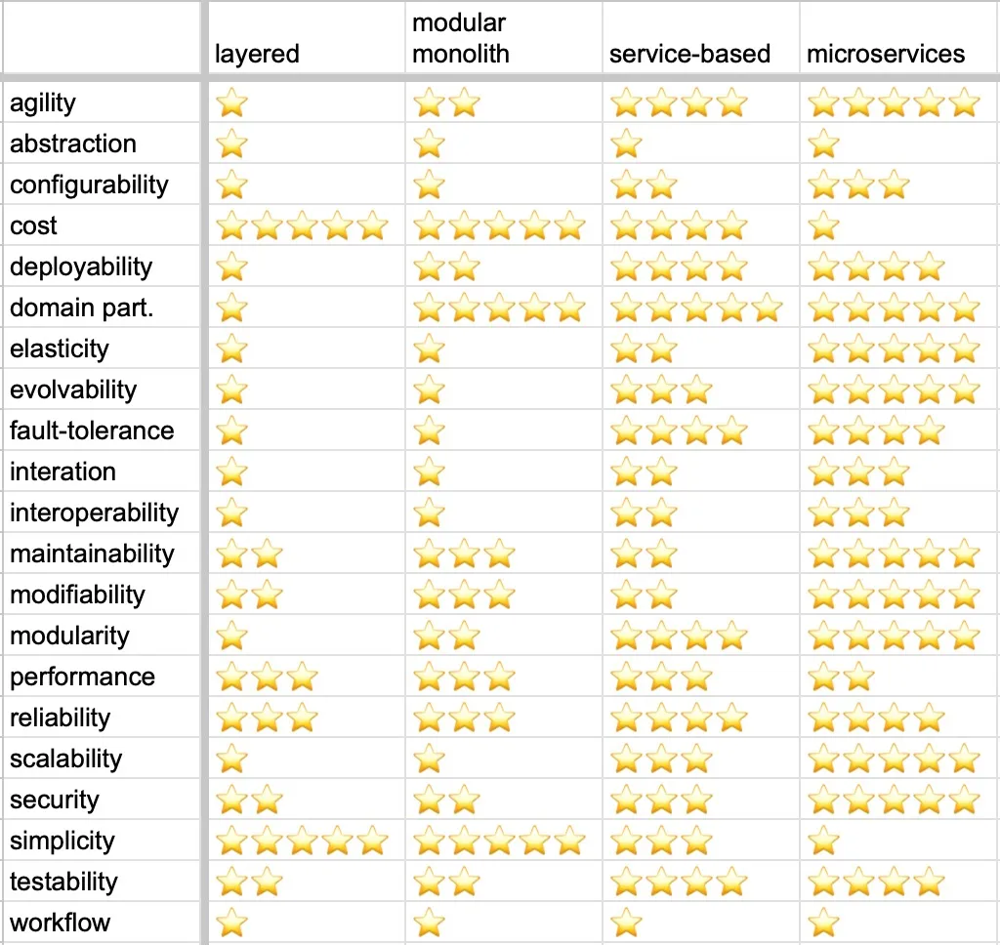

# Принятые решения в процессе определения bounded context'ов

## Problem Space

С помощью Make Cats Free (MCF) бизнес пытается решить проблему увелечения эффективности тестирования кошачих игрушек 
с помощью котов-воркеров. Для этого MCF должна стать аналогом биржей котов-тестировщиков-фрилансеров, которых будет
просто набирать, тестировать и с которыми будет просто решать организационные моменты (оплата, трудоустройство).
Через это же приложение Клиенты (которым нужно протестировать игрушки) должны вести свои взаимотношения с котами.
В дальшейнем заказ/задачу на тестирование я буду просто называть "задача". 

## Выделение Поддоменов

С точки зрения бизнес домена я выделил в MCF следующие поддомены:
1. Выполнения задач Котами-воркерами (или просто Выполнение Задач)
2. Заказа задач Клиентами (или просто Заказ Задач)
3. Матчинг Котов-воркеров и Клиентов
4. Сбор расходников для задачи
5. Увеличение лояльности клиентов
6. Контроль качества
7. Биллинг Котов-воркеров
8. Биллинг Клиентов
9. Рекрутинг Котов-воркеров
10. Ставки

Далее следует объяснение почему были выбраны те или иные поддомены. В основном я опирался на наличие обособленного
ubiquitous language или на пересечение терминов (один и тот же термин означет разное в разных поддоменах) для выделения
отдельного поддомена.

### Выполнение задач Котами-воркерами и Заказ задач Клиентами

Я разделил домен выполнения задач, так как уже сейчас есть отличия между этими доменами, и еще больше отличий появится 
в будущем:
* [US-010] - Только коты-тестировщики могут запросить помощь
* [US-020] и [US-021] - только Клиенты запрашивают услуги и только в контексте Заказа задач имеет смысл изменять типы 
задач.
* [US-070] - Для воркера или сейчас или в будущем нужно будет внедрить жизненный цикл Задачи, а клиент только проверяет 
его результат
* [US-130] - Воркеру надо получать расходники

### Матчинг Котов-воркеров и Клиентов

Этот домен выделен в отдельный, по двум причинам:
* [US-290] - в системе матчинга уникальный для этого контекста ubiquitous language.
* Несмотря на то, что матчинг непосредственно относится у выполнению задач, если мы выделим отдельные департаменты,
то увидим, что Выполнением и модификацией задач и матчингом будут заниматься разные департаменты.

### Сбор расходников для задачи

* [US-150] - Возможно, что этот поддомен должен быть частью поддомена **Выполнения задач Котами-воркерами**, но здесь свой
ubiquitous language (расходники, печенье), и, возможно, что термин заказ печенья пересечется с термином заказа/задачи из 
контекстов задач.

### Увеличение лояльности клиентов

Проблему лояльности клиентов бизнес решает через подарки (печенье), которое доставляет бизнес-партнер ([US-150])

### Контроль качества

* Поддомен Контроля качества волнуют исключительно проваленные/отмененные задачи ([US-170])
  * То есть в поддомене Контроля качества термин **задача** отличается от того же теримна в Контекстах выполнения задач.
* Цель у поддомена Котроля Качества другая (оценить задачу => отправить результаты проверки) и контролем качества занимался
бы другой департамент

### Биллинг Котов-воркеров и Биллинг Клиентов

Биллинг Котов-воркеров и Клиентов разделен, потому что:
* Уже сейчас разные требования к этим биллингам (extra payments для воркеров([US-240]), разные биллинг циклы, разные
требования к переводу средств([US-190], [US-200]))
* Это приводит к тому, что если мы будем использовать термин Оплата в контексте общего Биллинга, то под ним могут
подразумеваться как Оплата Клиента, так и Оплата Воркера. А это разные термины, и к ним разные требования.
* Несмотря на выделения разных поддоменов, в реальности Биллингом, скорее всего, будет заниматься один департамент (хотя
Клиентами и Котами-Воркерами могут заниматься разные отделы/люди)

### Рекрутинг Котов-воркеров

* [US-080] - Реркутинг Котов-воркеров - это отдельная задача, никак не пересекающаяся с другими поддоменами. Здесь
свой ubiquitous language, и Коты-воркеры в этом поддомене отличаются от Котов-воркеров в других поддоменах. Тут они
кандидаты.

### Ставки

* [US-250] - В системе ставок свой отдельный ubiquitous language (термин **ставка** не встречается больше нигде в 
системе).
* Целью ставок является мотивация менеджеров
* **задача** в поддомене ставок нам интересна исключительно с перспективы ставок
* Ставками заниался бы отдельный департамент

## Определение типов поддоменов

Для определения типов поддоменов (core, supporting, generic) я составил [таблицу поддоменов] аналогичную таблице с урока.
Сам Core Domains Chart выложил на [miro board].
Были сомнения в том, является ли Рекрутинг Котов core доменом, но в [US-080] описано, что нам нужно топ 3% котов,
что является конкурентным преимуществом, так что я оставил его в core.
Сначала посавил "Ставки" в Generic зону, но Ставки на выполнения задач - это все-таки не типичная для бирж фриланса задача
и она помогает с мотивацией бизнеса, так что все-таки перенес ее в Supporting.
Сложно было выделить то, что можно отдать в outsource, но если что-то и можно отдать, то это:
* Ставки, так как это простой и не ключевой для компании функционал. Можно придумать интеграцию с таблицами, так как нужна
только "тетрадка" с расчетами, а не сами расчеты.
* Очень хотелось контроль качества отдать в аутсорс, но из-за [US-170], где Менеджеры компании могут связаться с клиентом
придется реализовывать самим, хотя это все еще Generic поддомен
* Биллинг я не решился выводить в аутсорс.

## Выделение боундед-контекстов

Для выделения боундед-контекстов я использовал [таблицу контекстов] аналогичную таблице с урока.
* Задачи оставил в разных контекстах, так как видно, что они уже разные и будут еще сильнее отличаться в будущем.
* Здесь я объединил программу лояльности с сбором расходников, так как в сточки зрения бизнеса это одно и то же. Хотя
кажется, что это может выстрелить в будущем :)
* Контексты Биллинга тоже решил вынести один-к-одному к доменам, так как процессы уже разные. 
* Ставки будут работать через простую интеграцию с таблицами, так как не нужно никаких выплат.

В итоге отобразил получившиеся контекста на [Miro доске с контекстами]. Не понятно правда как контексты отображать
относительно друг друга на этой диаграме.

## Сравнение получившихся контекстов с контекстами из первого урока

Основные изменения:
* Контекст выполнения задач разбился на два контекста - Портал задач воркеров и Личный кабинет клиента. Кажется, что 
в первом уроке я отталкивался от технической реализации "задачи", а со стороны бизнеса видно, что Задача для Клиента и
для Воркера - разные вещи.
* Стало понятно, что "печенька" не просто часть заказа, а зачатки системы лояльности для клиентов, так что это точно
отдельная проблема (поддомен). Но на данный момент я решил оставить ее в контексте "комплектации заказа" (кажется, что
может выстрелить в будущем).
* Система матчинга уже в первом уроке была отдельной проблемой бизнеса (поддоменом) и должна была быть в отдельном контексте.
А теперь добавился еще и уникальный для нее ubiquitous language.
* Перечитал [US-010] и понял что запросы о помощи отправляют только коты клиенты.

В итоге получилась новая схема [Event Storming'a].
Она лучше отражает то, что хочет получить бизнес, но кажется, что связи между контекстами стали запутаннее :(
Кажется, что есть проблемы с coupling'ом у контекста "Личный кабинет клиента" - он каплится буквально со всем. Возможно,
что несмотря на то что создание задач и их выполнение разные поддомены, они все равно являются частью одного контекста.

## Архитектурные характеристики

### Availability

Исходя из требований это неявное требование. Единственное связанное упоминание - [US-081], где упоминаются возможные
DDoS атаки.
Исходя из моего опыта, бизнес обычно стремится к "пяти девяткам" (99,999%) availability, так что в условиях
невозможности уточнения требований выставим их. Отслеживать даунтайм можно через системы мониторинга и статистику.

### Scalability

Бизнес говорит о Scalability в [US-081] и в общих пожеланиях по системе (количество заказов, котов и клиентов-котов).
Единственное место, где мы ожидаем возможный рост - это рекрутинг.
Там же речь идет и о **Elasticity** (возможные пиковые нагрузки).
Система должна выдерживать среднюю нагрузку в 10 заказов в день от 100 клиентов и поддерживать в среднем 20 воркеров.
Отдельно стоит "Рекрутинг", где нагрузки возрастают до 1_000 заявок в день и возможно пиковые нагрузки.
Так как ожидаемые пиковые нагрузки не указаны, то воспользуемся rule of thumb из СКС (структурированных кабельных систем),
и заложим еще 60% возможной пропускной способности - будем расчитывать максимум на 3_000 заявок в день.

### Modifiability

Пожелания бизнеса о Modifiability указаны в общих пожеланиях к системе:
* Низкий TTM - так как нет точных данных, то возьмем стандард индстрии - новый фичи должны быть в проде в течении одного
двухнедельного спринта.
* Бизнес хочет менять гипотезы по найму котов-воркеров с максимальной скоростью и надежностью - тут речь идет о контексте
"Рекрутинга". Здесь будут следующие сценарии:
  * Добавление нового вопроса в тест должно занимать не более минуты
  * Регистрация кота-воркера на тестирования должна занимать не более минуты

### Maintainability

Можно рассмотреть в рамках [US-081], но тут скорее про securability и elasticity идет речь. 
Характеристика неявная, но исходя из общих требований мы можем вывести следующие сценарии:
* Восстановление "Портала Выполнения Задач" должно занимать не более суток.
* Востановление "Биллинга" клиента должно занимать не более суток ([US-190] и [US-200])
  * Интеграция Биллинга с платежными системами должна быть восстановлена до биллинг цикла - иначе критический инцидент

### Securability (security)

Здесь можно выделить доступы к разным частям системы и возможные риски.
* Только менеджер имеет доступ к системе ставок
* Только клиенты имеют доступ к их биллингу
* Только клиенты имеют доступ к Личному кабинету клиента
* Только воркеры имеют доступ к порталу выполнения задач
* Только воркеры и менеджеры имеют доступ к их биллингу воркеров
  * Менеджеры могут только добавлять extra payment воркеру
* Только менеджеры имеют доступ к админке Рекрутинга
* Только менеджеры имеют доступ к контролю качества

Security Concerns:
* [US-081] - мы ожидаем DDoS атаки, так что стоит заложить покупку решения по защите от них (e.g., Qrator) в решение
  * Сценарий: При DDoS атаке сервис Рекрутинга продолжает функционировать.

### Performance

Из требований [US-081], [US-250] и общих пожеланий видно, что на большую часть системы ожидается небольшая нагрузка.
Точного Performance Budget'a нет, но мы можем выделить следующее:
* Performance влияет на Usability и основной упор должен быть на Critical Revenue системы, то есть на Личный Кабинет Клиента,
где создаются задачи.
* В идеале p75 для всех запросов должен быть 150ms, но так это не указано в требованиях (и в реальности сложно достижимо
и быстро ломается), то ограничимся 1 секундой p75 для всех запросов системы.

### Agility

Сложно отличить от Modifiability, но сюда можно отнести общие рекомендации:
* Низкий ТТМ
* Быстрая проверка новых гипотех по найму и отсеву воркеров

### Testability

Про тесты в требованиях не сказано ничего. Так как с бизнесом поговорить нельзя, то из своего опыта выдвину следующие
требования:
* Стараться достичь близкого к 100% покрытию кода юнит-тестами
* Покрыть интеграционными тестами весь Critical Revenue Path
* Стараться покрыть E2E весь Critical Revenue Path

### Deployability

В требованиях нет ничего о Deployability, но можео связать с Modifiability - должны успевать задеплоить изменения в прод
в течение спринта.

### Usability

Напрямую не упоминается в требованиях, поэтому надо сделать упор на usability для Клиентской части.
* Клиент должен суметь заргеистрироваться в течении минуты.
* Новый Клиент должен суметь начать оформление заказа в течении 10 секунд
* Новый Клиент должен суметь закончить оформление заказа после заполнения описания задачи в течении 10 секунд. 

### Consistency

Требований по Consistency нет, но мы можем сказать, что нет жестких ограничений от бизнеса по тому через сколько данные
должны синхронизироваться по системе, что позволит нам быть свободнее в выборе решений (e,g., мы можем свободно
использовать асинхронные коммуникации).

### Simplicity

Не упоминается в требованиях.

### Важные характеристики

Из имеющихся данных можно сделать вывод, что для бизнеса на данный момент важны следующие характеристики:
* Modifiability
* Agility
* Securability (security)
* Usability
* Scalability и Elasticity в контексте Рекрутинга

## Архитектурный стиль

Я использовал картинку из урока для сравнения архитектурных стилей

С учетом Cost (который всегда важен для бизнеса) и с учетом важных для бизнеса харктеристик выбор идем между двумя стилями:
* Modular Monolith
* Service-Based

Исходя из требований по Scalability и Agility я остановился на Service-Based architecture.

## Итоговая модель системы

### Сервисы

В итоге получились следующие сервисы:
* Отдельный сервис Рекрутинга для выполнения требований по Securability, Scalability и Elasticity
* Сервис Личного Кабинета Клиента, где клиента запрашивает новые задачи
* Портал выполнения задач, где Воркер выполняет задачи
* Отдельная система матчинга
  * Не уверен, что уникальный для этого домена ubiquitous language оправдывает создание отдельного сервиса
* Система комплектации заказа, включающая себя как расходники, так и печеньку для лояльности
* Контроль качества
* Асинхронный биллинг
* Ставки

### Коммуниакции

В итоге получилась следующая [диаграма коммуникаций].
Каждый элемент - отдельный сервис.
Получилось много доменных эвентов, и я не уверен, что стоило разделять клиентскую часть и часть воркеров на этом этапе.
С другой стороны асинхронный биллинг и ставки хорошо ложатся на эту архитектуру.

---

[таблицу поддоменов]: https://docs.google.com/spreadsheets/d/1l5SCBlFpdqd8tn2XNKZCdGuPMW5dmHmDSm5WLNXA9nA/edit?gid=0#gid=0
[таблицу контекстов]: https://docs.google.com/spreadsheets/d/1l5SCBlFpdqd8tn2XNKZCdGuPMW5dmHmDSm5WLNXA9nA/edit?gid=1428376046#gid=1428376046
[miro board]: https://miro.com/app/board/uXjVLrCcUFQ=/?moveToWidget=3458764614858722206&cot=14
[Miro доске с контекстами]: https://miro.com/app/board/uXjVLrCcUFQ=/?moveToWidget=3458764614873088172&cot=14
[Event Storming'a]: https://miro.com/app/board/uXjVLrCcUFQ=/?moveToWidget=3458764614874642750&cot=14
[диаграма коммуникаций]: https://lucid.app/documents/embedded/28239d33-0758-4da9-b295-99e8b710244c