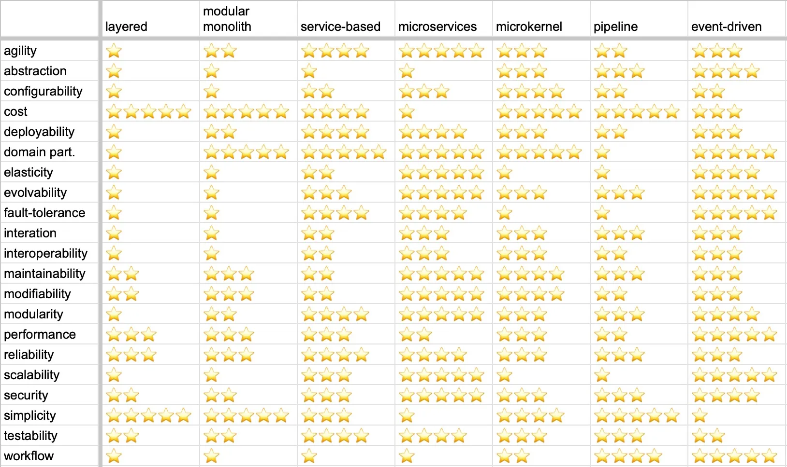
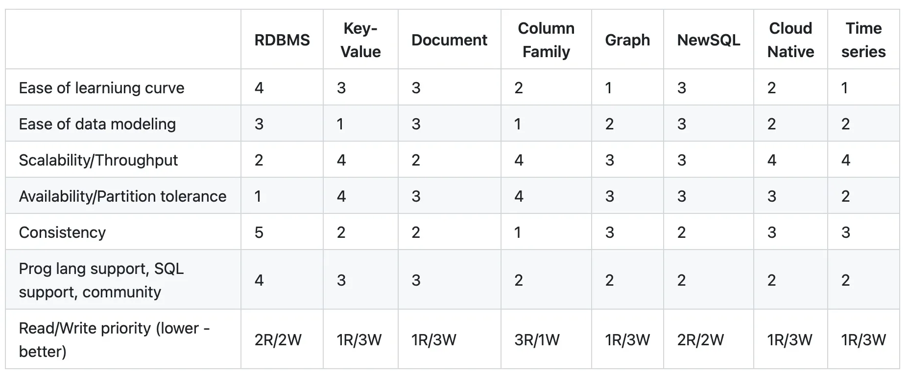

# Принятые решения

## Поиск и группировка стейкхолдеров

Помимо указанных в новых условиях стейкхолдеров, я выделил следующих:
* Коты-воркеры
* Сотрудники отдела расходников из [US-140]
* Овнеры системы матчинга из [US-290], добавленной во втором уроке
  * Кажется, что это отдельные люди и цели у них отдельный
  * Они точно informed и commited, и authorized и representative тут в желтой зоне

Для определения заинтересованности и влияния стейкхолдеров решил использовать стикеры на диаграмме и составить из них
[матрицу стейкхолдеров].

## Выбор архитектурного стиля

Для выбора архитектурного стиля я решил адаптировать выделенные домены и контексты со стороны бизнеса и замаппить
архитектурные характеристики на контексты.

### Определение поддоменов и контекстов

* Я так и не смог притянуть "Увеличение скорости обслуживания" как поддомен текущей проблемы, поэтому расходники
у меня - это один из боундед контекстов в домене "Менеджмент задач".
* Я не увидел проблемы привлечения клиентов у бизнеса, так как на данный момент все клиенты - это коты-тестировщики
из основной системы
* Несмотря на консерн от топ-менеджмента об уникальности скоринга, я посчитал его частью поддомена "Тестирование котов"
* Кажется, что алгоритм - это не техническая деталь, а решение бизнеса проблемы матчинга
* Не совсем понятно является ли расчет услуг отдельным контекстом в домене "Матчинга" - решил оставить только контекст
"Алгоритм матчинга".

В итоге получились следующие домены и контексты:
* [таблицы поддоменов и контекстов]
* [core domain chart]
* [схема контекстов в miro]

### Определение важных архитектурных характеристик и их маппинг на контексты

Я пересмотрел трбования и на выделил следующие:
* agility, testability и deployability для всей системы из-за требований по TTM
* Securability для всей системы из-за консерна топ-менеджмента о хранении всех данных у нас
* Добавил отдельный Securability для тотализатора из-за консерна менеджеров о том, что доступ к системе должен быть
только у них
* Перестал ориентироваться на cost, так как бизнес прямо указал, что тут ограничений не видит (В "Контекст и проблема домашки")
* Так как матчинг и рекрутинг уникальны и бизнес хочет в дальнейшем продавать скоринг, то сюда же идут scalability, 
availability и fault tolerance. Этот консерн также касается и создания задач, так как, исходя из консерна Менеджеров,
котов-клиентов сильно больше
* consistency ко всем расчетам исходя из консерна фин отдела по хранению данных
* configurability к расчетм клиенту исходя из консерна фин отдела о том, что будут добавляться новые способы оплаты для
клиентов (то есть интеграции с внешними системами)
* Я не понял на какую архитектурную характеристику отдельно влияет CatFinComplience, так что просто выписал отдельным
стикером
* configurability к "Доставки печенья", так как тут работа с внешним подрядчиком (интеграция с внешней системой)
* Modifiability в Тестирования Котов из-за консерна топ менеджеров о скоринге
* Modifiability, Evolvability и Simplicity в "Алгоритм Матчинга" из-за новых требований ([US-300]), где мы должны иметь
возможность просто добавлять, редактироват и менять последовательность шагов в алгоритме
* Modifiability и Maintainability в контексты кор поддоменов, как было в уроке и исходя из того как искать
требования в уроке 2.2 (из "Обратиться к целям компании"). Поддомены уникальны и сложны, но так как нет ни консернов, ни
требований по ним, связанных с этими характеристикам, то точного понимания почему они во всех кор доменах нет.

Далее я отобразил получившиеся характеристики на контекстах с помощью [стикеров и получившихся контекстов в miro].

### Выбор архитектурного стиля

Для выбора архитектурного стиля я опирался на таблицу из урока

На всю систему распространяются agility, testability, deployability и securability, и cost не является проблемой, 
поэтому для всей системы лучше всего подойдут микросервисы.

По сервисам получилось:
* Расчет сотрудников и Расчет клиентов - один сервис - microkernel
* Алгоритм матчинга - pipeline
* Тестирование котов - modular monolith
* Организация выездов - modular monolith
* Комплектация заказа - modular monolith
* Контроль качества - modular monolith
* Доставка печенья - layered monolith
* Тотализатор - layered monolith

Заметки по выбору архитектуры для сервисов:
* Расчет сотрудников и Расчет клиентов точно должны быть отдельно от остальной системы из-за требований по compliance'у
  и consistency.
  * Чтобы не переусложнять систему, я решил объединить их в один сервис с microkernel архитектурой, где разные типы
    расчетов встраиваются отдельными плагинами. microkernel позволит покрыть требования по configurability
* К Алогритму матчинга есть отдельные требования по Simplicity и Modifiability, которые хорошо ложаться на pipeline.
* Доставку печенья можно сделать через microkernel с единственным пока что плагином или обычным монолитом, так как это
  supporting домен (чтобы упростить разработку). Так как пока что мы не ожидаем дополнительных интеграций, то я остановился
  на layered монолите.
* К тотализатору есть дополнительные требования по Securability (доступ для менеджеров), так что с точки зрения архитектуры
  мы можем остановиться на layered монолите.

## Выбор БД

Для выбора БД я использвал табличку из урока:

Так как cost не является консерном, то для каждого сервиса будет отдельная БД.

* Расчеты - RDBMS из-за consistency (потенциально event sourcing с event storage и кешированием projection'ов
на самом деле)
* Алгоритм матчинга - RDBMS
* Тестирование котов - RDBMS + Key-Value для кеширования (из-за консернов по поводу scalability/elasticity)
* Организация выездов - RDBMS + Key-Value для кеширования (из-за консернов по поводу scalability/elasticity)
* Комплектация заказа - RDBMS
* Контроль качества - RDBMS
* Доставка печенья - RDBMS
* Тотализатор - RDBMS

RDBMS укалдывается в требования системы, знаком большинству разработчиков и все, что описано в требованиях можно
на нем реализовать, так что не увидел смысла в других типах БД для нашей системы.

## Коммуникации

Получилась такая примерная [схема коммуникаций].

Так ограничений в сервисах и ограничений по cost'у нет, то все коммуникации асинхронные за исключением
вызовов к внешним системам - тут вызовы к синхронным API.

## Фитнес функции

### Вся система

* Testability
  * Интеграция с codecov; lines, branch coverage > 90%
  * формулировка Critical Revenue Path, создание E2E тестов для него 
  (тут будет сложная настройка инструментов для отслеживания покрытия кода тестами - возможно сначала лучше без покрытия E2E)
* Agility - Для контроля количества релизов интеграция JIRA с BigQuery; сбор статистики и рассылка с ней раз в месяц
  * Тут не обойтись без выстроенных процессов разработки (roadmap'ы, грамотный ticket refinement, grooming, etc) - 
  иначе в метриках смысла не будет
* Securability 
  * Аппрув на создание топиков - конифгурация брокера через GitOps - только с аппрувом группы архитекторов

### Менеджер заказов

* Elasticity/Scalability - Провести нагрузочное тестирование перед релизом
* Modifiability
  * Rails Engines + Packwerk для отслеживания coupling/cohesion между модулями
  * Packwerk PR check перед мерджом для проверки coupling/cohesion'a

### Алгоритм матчинга

* Modifiability
  * Rails Engines + Packwerk для отслеживания coupling/cohesion между модулями
  * Packwerk PR check перед мерджом для проверки coupling/cohesion'a
* Simplicity
  * Фидбек форма для стаффа при изменении порядка алгоритма - анализ фидбека раз в месяц

### Тестирование котов

* Elasticity/Scalability - Провести нагрузочное тестирование перед релизом
* Modifiability
  * Rails Engines + Packwerk для отслеживания coupling/cohesion между модулями
  * Packwerk PR check перед мерджом для проверки coupling/cohesion'a

## ADR

ADR получился таким - https://github.com/Lokideos/systems_analysis/blob/lesson-3/lesson_3/adr.md
Было ощущение, что я просто переношу свои рассуждения из этого файла туда.

---

[матрицу стейкхолдеров]: https://miro.com/app/board/uXjVLrCcUFQ=/?moveToWidget=3458764615753448636&cot=14
[таблицы поддоменов и контекстов]: https://docs.google.com/spreadsheets/d/1u3SD_ucXthX9XhqUwknfcfWJyrMSxqOPxc_6a5zosyk/edit?usp=sharing
[core domain chart]: https://miro.com/app/board/uXjVLrCcUFQ=/?moveToWidget=3458764615754376883&cot=14
[схема контекстов в miro]: https://miro.com/app/board/uXjVLrCcUFQ=/?moveToWidget=3458764615759523261&cot=14
[стикеров и получившихся контекстов в miro]: https://miro.com/app/board/uXjVLrCcUFQ=/?moveToWidget=3458764615766035940&cot=14
[схема коммуникаций]: https://miro.com/app/board/uXjVLrCcUFQ=/?moveToWidget=3458764615783206742&cot=14